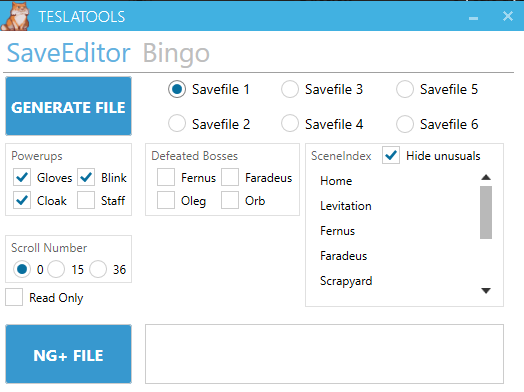
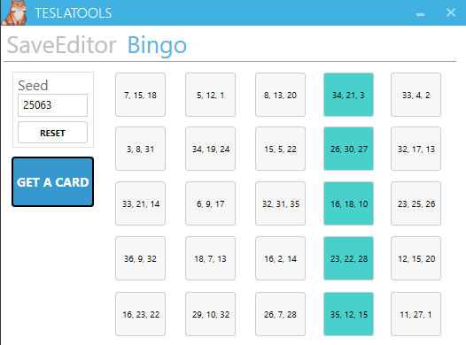

# TeslaTools
A program to group multiple tools for the Teslagrad speedrunning community.

## Save Editor
This tool creates customisable saves directly into the Teslagrad save folder. You can select checkpoints, powerups, defeated bosses in any order, number of scrolls and even read-only file-type, in order to avoid the game overwriting your favorite training spot ! Usefull for NG+, exploits research, and also a good way to practice particular spots.

## Bingo
This tool generates bingo cards for bingo races. For now it randomly generates 5x5 cards with tuples of 3 scrolls on each objectif. The idea being that a bingo run consists of getting all the scrolls in any row/column/diagonal (5x3=15 scrolls) and then finish the game.

I had other objectives in mind like visiting all the grues in the game/killing or not bosses/performing specific tricks or killing a certain amount of different voidwalker. I also had an idea for a reverse bingo run where you use the save editor to generate a save file at the top of the tower with all bosses alive and then you have to climb down the tower, make your way through the game backwards. Solving puzzles in reverse leading to new strats. Unfortunately I lost motivation for those and never really finished designing this.

---

## Not integrated into Teslatools
Not working on those at the moment but the goal use to be to include them eventually.

### TeslaSplit
Created by BoursinBurger, currently available at [TeslaSplit](https://github.com/BoursinBurger/TeslaSplit)
This tool watches the Teslagrad save game files looking for updates. New saves are made upon entering a room, killing a boss, collecting an item, etc. Upon encountering a key event you're anticipating, it will press the split hotkey for your timesplitting program. This allows hands-free and consistently accurate split times.

Note: I thought of some funny features like an interactive map that could make use of the same principle as TeslaSplit for reading savefiles.

### TASlasgrad
This tool records inputs and then play them back for TASing or multi-segment. First attempt to this program (by Dioxymore and me) had major de-sync issue. Recently, DevilSquirrel made a new tool which appear to work a little better by replacing some of Teslagrad's DLL. It can be found [here](https://github.com/ShootMe/TeslagradTAS).

### TeslaViewer
Created by Dioxymore (no repo available at the moment). This tool is under construction, still a proof of concept and need some polish. The idea is to display some informations ingame like the character's speed and position, checkpoints and more. Uses the same technique as TASlagrad (replacing game's DLL) to access some ingame variables.
